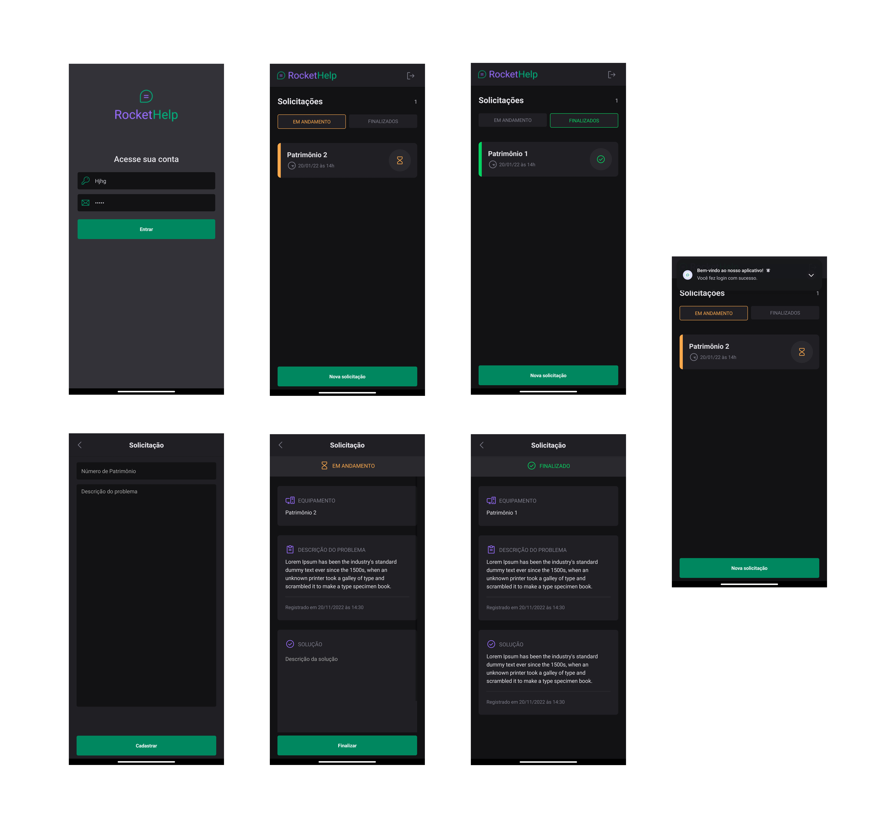

<p align="center">
  <h3 align="center">Rocket Help</h3>

  <p align="center">
    
  </p>

  <p align="center">
    This Android app was developed as a study project.
    <br />
    <br />
  </p>
</p>

<!-- TABLE OF CONTENTS -->
## 🗂 Table of Contents

* [About the Project](#book-about-the-project)
  * [Technologies](#computer-technologies)
  * [Requirements](#construction-requirements)
* [Installation](#bricks-installation)
  * [Installing Dependencies](#construction-installing-dependencies)
  * [Running](#arrow_forward-running)

## :book: About The Project


The project involves the creation of a ticketing system for learning purposes, using React Native.

### :computer: Technologies

* [Javascript](https://www.javascript.com/)
* [Node.js](https://nodejs.org/en/)
* [React Native](https://reactnative.dev/)

### :construction: Requirements
- Any Operating System having [react-native-cli](https://reactnative.dev/docs/environment-setup) installed.
- To make build your computer should have Android studio installed for android.

## :bricks: Installation

This project use [Node.js](https://nodejs.org/en/) and [npm](https://www.npmjs.com/), you will need them to build its dependencies.


Clone this project repository:
```bash

$ git clone https://github.com/aridsonf/rocket-help.git

# Enter in `rocket-help` folder:

$ cd rocket-help
```

🚨 If you don't have git in your machine, you can install it [here](https://git-scm.com/downloads).


## :construction: Installing Dependencies

Inside mobile folder, install dependencies with following comand:

```bash
$ yarn install
```


## :arrow_forward: Running

Run following command to create the .apk to you install in your Android device:

```bash
# Create the .apk (Android)
$ eas build -p android --profile preview2
```

If you want you can use the .apk in the /apk folder in the root of the project.

<p align="center">Developed by Aridson Filho</p>